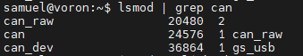
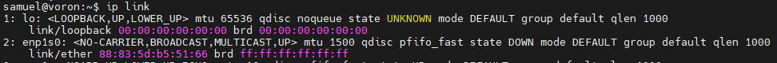
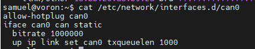
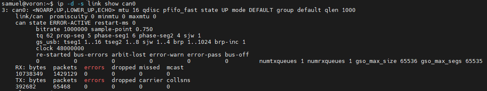
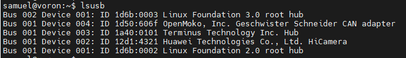

# Klipper使用CANBUS调试方法
很多人在初次使用CAN连接主控板和工具板的时候遇到问题，这里总结一些检查步骤以供参考。下面以Debian系统为例进行讲解。

### 1、查看内核CAN模块加载情况
执行命令：
``` bash
lsmod | grep can
```
将会出现类似的结果



如果没有，执行命令：
``` bash
sudo modprobe can
``` 
如果出现类似
```
modprobe: ERROR: could not insert 'can'
```
这样的错误提示，则表示系统内核并未开启CAN支持，此时上位机将无法使用CAN，必须更换系统。

### 2、检查系统命令是否可用
自2001年起，Linux社区已经停止维护net-tools，转而使用iproute2来代替，
因此我们不再使用ifconfig命令，转而使用ip命令。执行命令：
``` bash
ip link
```
确认是否返回网络接口相关信息，如



通常新版本的系统都会预装iproute2，如果没有请自行安装：
``` bash
sudo apt-get update
sudo apt-get upgread
sudo apt-get install iproute2
```

### 3、检查CAN网络配置
执行命令
``` bash
cat /etc/network/interfaces.d/can0
```
检查是否是和下面的内容一样



其中"bitrate 1000000"中的1000000是波特率，波特率越高，每秒传送数据就越多，
可以根据自己实际情况，设置成250000或者500000，建议使用1000000。

??? info "关于txqueuelen大小"

    [源文档](https://www.klipper3d.org/CANBUS_Troubleshooting.html#use-an-appropriate-txqueuelen-setting)
    It is not recommended to use a `txqueuelen` significantly larger than 128.
    A CAN bus running at a frequency of 1000000 will typically take around 120us
    to transmit a CAN packet. Thus a queue of 128 packets is likely to take around
    15-20ms to drain. A substantially larger queue could cause excessive spikes in
    message round-trip-time which could lead to unrecoverable errors. Said another
    way, Klipper's application retransmit system is more robust if it does not have
    to wait for Linux to drain an excessively large queue of possibly stale data.
    This is analogous to the problem of 
    [bufferbloat](https://en.wikipedia.org/wiki/Bufferbloat) on internet routers.
    在使用CAN总线时，不建议将txqueuelen设置大于128。CAN总线以1000000的频率运行时，发送
    一个CAN数据包通常需要大约120微秒。因此，一个包含128个数据包的队列可能需要大约15-20毫
    秒才能排空。如果队列远远大于这个大小，可能会导致消息往返时间出现过多的波动，进而可能导
    致无法恢复的错误。换句话说，Klipper应用的重传系统在不必等待Linux排空可能过期的数据的
    情况下更加健壮。这类似于互联网路由器上的“缓冲过载”问题。

    在实践中会发现，缓冲设置为128会遇到timer too close报错，所以应用中实际可以适当加大此值。
    


如果你要修改，可以直接完整复制下方6行内容到终端执行：
``` bash
sudo /bin/sh -c "cat > /etc/network/interfaces.d/can0" << EOF
allow-hotplug can0
iface can0 can static
  bitrate 1000000
  up ip link set can0 txqueuelen 256
EOF
```
然后再次执行命令：
``` bash
cat /etc/network/interfaces.d/can0
```
检查无误，执行命令重启网络：
``` bash
sudo systemctl restart networking
```
或者执行命令重启系统：
``` bash
sudo reboot
```
等待系统重新联网

### 4、检查CAN网络接口
执行命令
``` bash
ip -d -s link show can0
```
看是否返回CAN网络相关信息，如



如果有，跳到第6步，否则继续

### 5、检查U2C或者使用CAN Bridge模式的主控板是否连接
执行命令
``` bash
lsusb
```
如果没有类似



[ Bus 001 Device 004: ID 1d50:606f OpenMoko, Inc. Geschwister Schneider CAN adapter ]

这样的设备，说明主控板没连上或者主控板固件并不是CAN Bridge模式。

尝试：检查主控板电源、USB连接线是否连接正常，重刷固件。
（U2C也是建议使用CAN Bridge模式固件）

以上检查无误后再次尝试步骤4

### 6、查找主控板并进行Klipper配置

??? info "多控制板操作建议"

    如果你有多块主板/工具板，建议分次连接，以免过多UUID造成干扰。
    第一次只连接CAN Bridge固件的主板，配置完成以后，再增加下一块控制板。

通过以下命令获取主控版UUID：
``` bash
~/klippy-env/bin/python ~/klipper/scripts/canbus_query.py can0
```
打开Mainsail或者Fluidd，在界面中修改配置文件，添加
```
[mcu]
canbus_uuid: fea6ca620740
```
修改完成后点击保存并重启

### 7、配置更多控制板
每次增加一块控制板，然后通过以下命令获取控制版UUID：
``` bash
~/klippy-env/bin/python ~/klipper/scripts/canbus_query.py can0
```
打开Mainsail或者Fluidd，在界面中修改配置文件，修改
```
[mcu]
canbus_uuid: fea6ca620740
# 多控制板就添加多个
[mcu a]
canbus_uuid: fea6ca620741
```

### 8、调试打印机
完成以上步骤后就可以根据打印机实际情况修改配置文件，开始调试打印机。