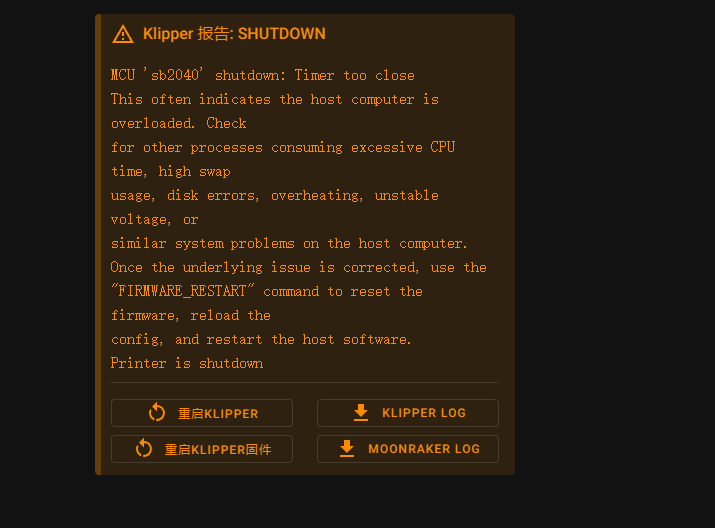
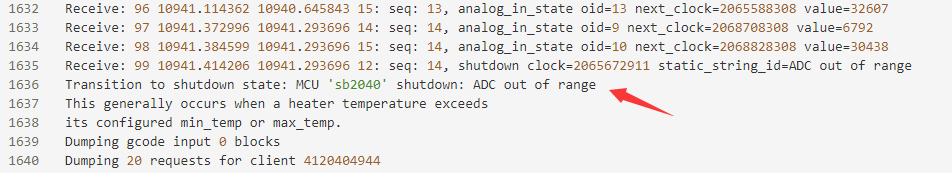
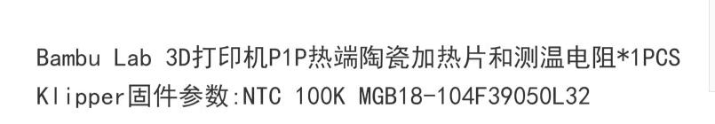
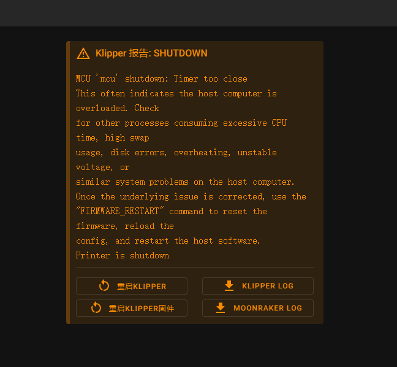
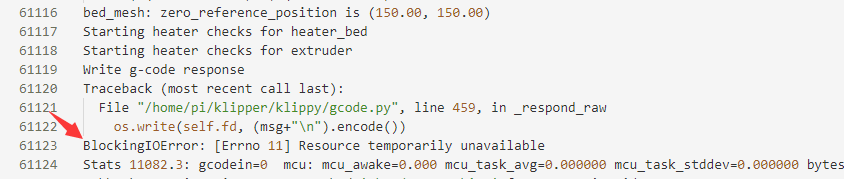
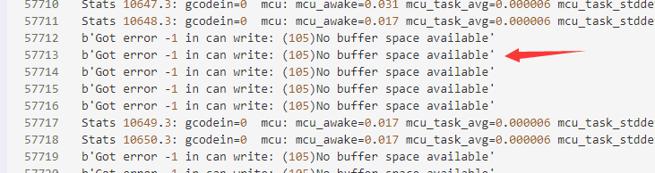
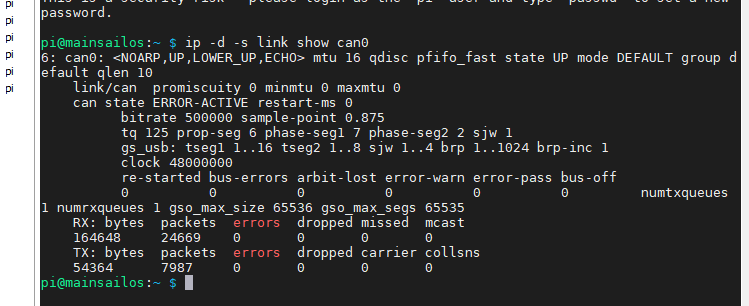

## 因更换热端引起的Timer too close报错案例

### 问题

群友换了TZ热端，装上调试遇到SB2040报错Timer too close，



### 检查与对应处理

检查日志发现ADC异常，



修改了NTC参数，



还是报错Timer too close，



换成EBB，换回老的热端，依旧Timer too close。检查日志，这次是系统IO错误。



怀疑是树莓派的系统SD卡存在坏块，重装系统。

再次运行依旧Timer too close，检查日志，



发现是CAN缓存空间不足，执行命令

``` bash
ip -d -s link show can0
```



确定是txqueuelen的问题，修改

``` bash
sudo /bin/sh -c "cat > /etc/network/interfaces.d/can0" << EOF
allow-hotplug can0
iface can0 can static
  bitrate 1000000
  up ip link set can0 txqueuelen 1000
EOF
```

Timer too close 问题解决。

### 总结

遇到Timer too close 问题，不要像无头苍蝇一样，就盯着Timer too close，仔细检查日志文件，从中发现线索，对症处理。
