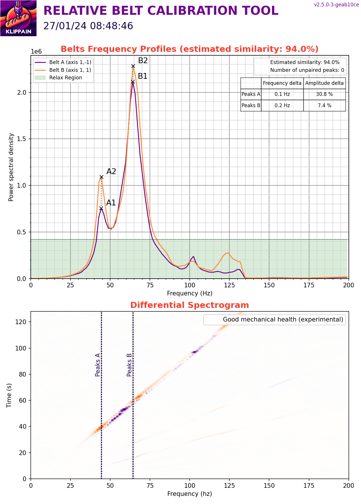
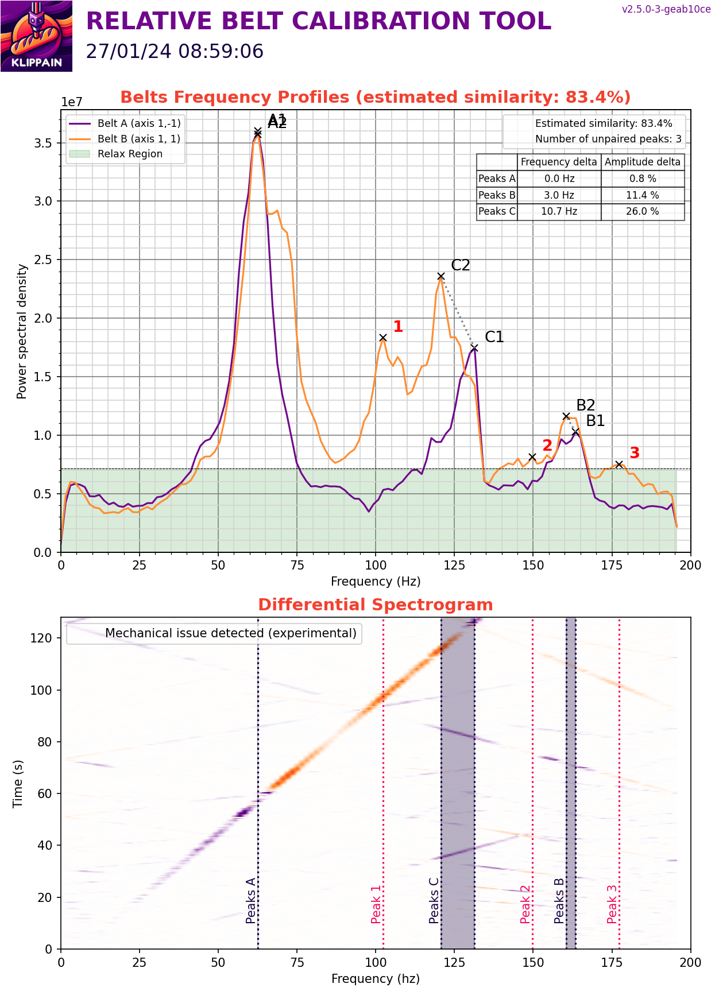

# 使用klippain-shaketune检测并调整因震动/装配不合理对打印的影响

以下内容均删减整理自[klippain-shaketune](https://github.com/Frix-x/klippain-shaketune)，中文翻译Samuel Wang (aka 三木)，转载中文内容请著名出处。

## 初始化配置

1、使用命令安装klippain-shaketune
```
wget -O - https://raw.githubusercontent.com/Frix-x/klippain-shaketune/main/install.sh | bash
```

2、在klipper配置文件中引用klippain-shaketune的配置文件
```
[include K-ShakeTune/*.cfg]
```
3、请确保已经按照[Measuring Resonances Klipper documentation](https://www.klipper3d.org/Measuring_Resonances.html)文档的说明配置好了加速度传感器，并添加了[resonance_tester]设置。

## 注意事项

- 工具头风扇可能会对测试造成影响，测试时不要开启热端加热。
- 测试时尽量模拟实际打印时的环境，如仓温。
- 首先运行宏MEASURE_AXES_NOISE检查各轴输出值是否小于100，如果不是请先检查加速度计的安装和线缆干扰情况。
- 每次测试的图形可能都会有微小差异，不要在意这些细节

## 加速度计的安装位置对测量结果的影响

| 安装位置 | 优势 | 劣势 |
| :----: | :---- | :---- |
| 直接在喷嘴尖端 | 提供了全面的视角，能观察到所有机器振动，包括主要的共振，也包括工具头摆动和全局框架运动。非常适合诊断运动学问题和排除故障。 | 导致数据更嘈杂，这可能会在机器不完美或不完全刚性的情况下使最终的输入成形滤波器选择变得复杂。 |
| 靠近工具头的重心 | 主要显示工具头和皮带的主要共振频率，允许为输入成形选择精确的滤波器。数据通常更干净，只有严重的机械问题或非常严重的工具头摆动才会在图表中可见。 | 可能无法提供次要振动的详细信息（这些对振纹的影响相对较小），且可能在诊断不相关的机械问题时效果不佳。 |
| 集成在CANBus板上的加速度计 | 简单有效，不需要额外的安装，始终可用。可以帮助诊断如Bowden管、连接线束和电缆链等导致的问题。如果工具头非常坚固，测量结果与重心的测量非常接近。 | 由于距离喷嘴尖端较远，并且可能受到附加组件的噪音影响，因此在详细分析或诊断机械问题方面不够准确。 |

通常情况下，您应该尽量集中注意力在工具头/皮带的机械子系统上，以减轻共振问题（因为它对振纹和打印质量的影响最大），但是您不应忽视喷嘴尖端测量的重要性，以检测其他振动源。如果共振分析结果在不同的安装点之间有很大差异，建议加强工具头的刚性，以最大限度地减少摆动和振动。以下是一个方法来系统地解决机械问题，然后根据需要选择输入整形滤波器的日常策略：

1、诊断阶段：从喷嘴尖端安装点开始，识别和排除机械问题，确保打印机组件健康，并且组装完好且优化良好。

2、选择滤波器阶段：如果图表的大部分数据都比较清晰，您可以将焦点转移到靠近工具头重心的安装点，以获取关于主要共振的更干净的数据，这有助于准确设置输入整形滤波器。您还可以考虑使用CANBus板集成的加速度计，因为它简单易用，特别是如果工具头特别坚固且受摆动影响较小。

## 皮带相对差值测量

适用于CoreXY机器，可以通过测量和绘制行为差异来帮助诊断皮带路径问题。还可用于皮带张力调整辅助。

### 使用方法

在开始之前，请确保皮带正确张紧。例如，可以参考[Voron皮带张紧文档](https://docs.vorondesign.com/tuning/secondary_printer_tuning.html#belt-tension)。这很关键：需要一个良好的起点，然后从中进行迭代！

然后，调用COMPARE_BELTS_RESPONSES宏，并查看结果文件夹中的图形。以下是可用的参数：

| 参数 | 默认值 | 描述 |
| :----: | :----: | :---- |
| FREQ_START | 5 | 起始激励频率
| FREQ_END | 133 | 最大激励频率
| HZ_PER_SEC | 1 | 每秒赫兹数
| KEEP_N_RESULTS| 3 | 运行测试后在结果文件夹中保留的结果总数。旧结果会自动清理
| KEEP_CSV | 0 | 是否将CSV数据文件与PNG图形一起保留

### 图形解读


### 结果分析

这些图表上，两条曲线看起来相似并重叠成一个单一的曲线：尽量使它们在频率和振幅上紧密吻合。通常，皮带图表由一个或两个主峰组成（超过2个峰可能暗示机械问题）。在主峰周围出现“噪音”是可以接受的，但它应该在两条曲线上都有，并且振幅相当。请记住，当您拉紧皮带时，其峰值应该朝着右上角的对角线方向移动，振幅会显著变化，而频率略微变化。此外，主峰的幅度顺序通常应在大多数机器上介于~500k到~2M之间。

除了实际的皮带张力之外，曲线的共振频率/振幅主要取决于三个参数：

- 工具头的重量，在CoreXY、CrossXY和H-Bot机器上，A和B皮带的重量相同。因此，在这里不太可能产生任何影响。
- 皮带的“弹性”，随着时间的推移会随着皮带磨损而发生变化。确保A和B皮带使用相同品牌和类型，并且它们是在相同的时间安装的：具有相似磨损水平的相似皮带！
- 皮带路径长度，这就是为什么它们必须具有完全相同的齿数，以便在以相同张力拉紧时，一个皮带路径不会比另一个更长。这个具体的点非常重要：只要有一颗齿的差异就足以阻止获得良好的曲线重叠。这个问题需要重点关注。

如果这三个参数都得到满足，那么曲线不可能有所不同，或者可以确定至少一个皮带路径存在潜在问题。此外，如果皮带图表的曲线幅度较低（没有明显的峰），而且噪音很多，那么可能也会有较差的输入整形器图表。因此，在继续之前，请确保拥有良好的皮带图表或修复皮带路径。首先检查皮带张力、轴承、龙门螺丝、皮带在滚轮上的对准等等。

### 皮带图表中可能出现1或2个峰的情况

1、对角线运动产生两个子系统：在这种情况下，我们观察到两个不同的子系统运动，一个是工具头沿X线性轴左右移动，另一个是工具头和X线性轴一起前后移动。实际上，我们观察到的不是一个单一的谐振系统，而是两个交织在一起的子系统运动。这种复杂性可能导致皮带图表中出现两个谐振频率（或峰值）。但由于两个子系统都使用相似的皮带、张力等参数，这些峰值有时会合并在一起，看起来像是一个峰。

2、工具头持续连接到两个皮带：当进行对角线运动来刺激一个皮带时，另一个皮带保持静止并充当锚点。但由于其弹性，这个皮带并不保持刚性。它会向整个系统响应中引入其独特的特性，这可能会引入额外的噪音甚至第二个峰。

总的来说，这两个因素共同作用可能会导致皮带图表中出现1或2个峰。这种情况下，需要仔细分析系统以理解这些峰的来源，并确定是否需要进一步调整皮带或其他参数以优化系统性能。

### 图例

#### 好的图例

以下图表被认为是良好的。它们都只有一个或两个峰，并且它们重叠得很好，形成了一个单一的曲线。皮带图表显示出了预期的行为，即相似的振荡频率和幅度，没有明显的异常或噪音。这是一个良好的信号，表明皮带系统工作正常，可以继续进行后续的[输入整形图表](#输入整形测量)的步骤，以进一步优化系统性能。

| 只有1个峰 | 有2个峰 |
| :----: | :----: |
|  |  |

#### 皮带张力有问题

图表显示由于不正确或不均匀的皮带张力而引起的振动模式或谐振频率的变化。这种情况下，您需要谨慎地调整皮带张力，以确保每个皮带都受到适当的张力，从而最大限度地减少振动和噪音，并确保机器的正常运行。

| 描述 | 案例图 |
| :---- | :----: |
| A皮带张力略低于B皮带张力。可以通过仅将螺丝拧紧约半圈至一整圈来快速解决。通过对螺丝进行轻微的调整，您可以逐步调整A皮带的张力，直到与B皮带达到相同水平。这样可以确保两个皮带都受到适当的张力，从而优化系统的运行。 |  |
| B皮带张力明显低于A皮带张力。如果遇到这样的图表，建议回顾[Voron皮带张力调整文档](https://docs.vorondesign.com/tuning/secondary_printer_tuning.html#belt-tension)，以获得更为可靠的基础。通过轻微地增加B皮带的张力并相应地降低A皮带的张力，可以尝试将它们调整到更平衡的状态，但要谨慎行事，以避免偏离推荐的110赫兹基准，以免影响系统的性能和寿命。 |  |

#### 皮带路径有问题

如果发现即使在正确调整皮带张力的情况下，曲线的调整和重叠仍然不可行，可能存在其他问题导致这种情况。需要检查皮带路径是否存在异物阻碍、轴承是否正常运转、是否有磨损迹象以及皮带是否在运动中正确对齐。通过检查这些因素，可以确定并解决任何可能影响皮带运行的问题，从而使调整和曲线重叠成为可能。

| 描述 | 案例图 |
| :---- | :----: |
| 在这张图表上，有两个峰值。第一对峰几乎对齐，但第二个峰只出现在B皮带上，与A皮带明显偏离。由于第二个峰值仅在B皮带上出现，而A皮带没有，这可能意味着B皮带在其路径上遇到了障碍或其他问题，导致了这种偏离。需要仔细检查B皮带路径，确保没有任何阻碍物或其他因素影响了其运行，从而解决这个问题。 |  |
| 这张图表相当复杂，显示了3个峰值。虽然所有对峰看起来都很好地对齐，并且张力正常，但图表显示了三个峰值而不仅仅是两个，因为[1]被分成了两个较小的峰值。这可能暗示着在系统中存在一些未知的复杂性或问题。为了确定这种情况的影响，建议生成[输入整形图表](#输入整形测量)，这将有助于更好地理解并识别任何潜在的问题或改进机会。 |  |
| 图表显示了信号强度较低（峰值约为300k，而典型值约为1M），噪音较多，这可能是由于皮带张力过低或存在其他问题，例如卡阻、摩擦等，导致工具头移动受到影响。建议首先回到[Voron皮带张力调整文档](https://docs.vorondesign.com/tuning/secondary_printer_tuning.html#belt-tension)，确立稳健的皮带张力基础，然后生成[输入整形图表](#输入整形测量)，以识别和解决任何可能存在的卡阻或其他问题。 |  |

#### 频谱图灯光秀 (LIS2DW)

将LIS2DW整合为Klipper中的谐振测量设备正在变得越来越普遍，特别是因为一些制造商正在宣传其优于传统ADXL345的优势。它确实是一款新一代芯片，应该更适合测量传统的“加速度”。然而，对它们的数据表和实际测量的详细比较描绘了一个更加复杂的图景：LIS2DW具有更高的灵敏度，但它的采样率较低，并且产生显著的混叠，导致光谱图上出现“灯光秀”效应，其特征是与主要谐振平行的多个虚假谐振线，伴随着相交的干扰线扭曲了谐波轮廓。

对于皮带图表来说，这可能会成为一个问题，因为它会给结果引入大量噪音，并使它们难以解释，可能会告诉你存在机械问题，实际上并不存在。

| ADXL345 测量结果 | LIS2DW 测量结果 |
| :----: | :----: |
|  |  |

## 输入整形测量

AXES_SHAPER_CALIBRATION 宏用于测量和绘制轴的行为，以调整 Klipper 的输入整形器系统。

### 使用方法

在开始之前，请确保皮带已经正确张紧，并且您已经获得了良好清晰的皮带图表（参见前一节）。

然后，调用 AXES_SHAPER_CALIBRATION 宏，并查看结果文件夹中的图表。以下是可用的参数：

| 参数 | 默认值 | 描述 |
| :----: | :----: | :---- |
|FREQ_START|5|开始激励频率
|FREQ_END|133|最大激励频率
|HZ_PER_SEC|1|每秒赫兹数
|AXIS|"all"|要测试的轴，可以是 "all"、"X" 或 "Y"
|SCV|打印机方形拐角速度|用于计算整形器建议的方形拐角速度。通常使用较高的SCV值会导致更平滑的效果和较低的最大加速度
|MAX_SMOOTHING|None|计算整形器建议时允许的最大平滑度
|KEEP_N_RESULTS|3|运行测试后在结果文件夹中保留的结果总数。旧结果会自动清理
|KEEP_CSV|0|是否将CSV数据文件与PNG图形一起保留

### 图形解读


### 结果分析

#### 泛泛而谈

为了有效地分析输入整形器图表，由于影响3D打印机性能或输入整形器测量的各种因素的多样性，没有一种通用的方法适用于所有情况。然而，以下是一些阅读图表的提示：

- 一个具有单一而细小峰值且与背景噪声分离良好的图表是理想的，因为它可以很容易地通过输入整形器进行滤波。但是，根据机器及其机械配置的不同，有时无法获得这种形状。获得更好图表的关键是机械装配的清洁度，特别关注桌子、打印机底座、框架和工具头的刚度和硬度。
- 至于皮带图表，重点是图表的形状，而不是数值。实际上，能量值并不提供太多有用信息。仅将其用于比较两个自己的图表，并在两次连续测试之间测量您的机械变化的影响，但永远不要用它与其他人或其他机器的图表进行比较。


关于如何设置输入整形器滤波器的详细说明，以及如何解释图表顶部右侧显示的自动计算数值的解释：

* 滤波算法：Klipper会自动计算这些线条。如果图表干净，这个计算通常效果不错。但如果你的图表杂乱无章，它就无法做出良好的建议。在继续之前最好先解决机械问题。每种滤波器都有其优缺点：

  - ZV 是一种较轻的滤波器，通常会有一些残余振动。我建议只有在你想要以最高加速度值进行速度测试并同时保持零件表面的平滑度较低时才使用它。如果你的图表几乎完美并且不太在意一些残余振动，你可以尝试使用它。
  - MZV 通常是机械调整良好的机器的首选。它是在保持较低残余振动的同时允许相当不错的加速度值的良好折衷方案。请记住，Klipper只会在图表良好的情况下建议使用MZV。
  - EI 可以作为具有挑战性图表的备选方案。但首先，请尝试解决机械问题：几乎每台打印机都应该能够使用MZV。
  - 2HUMP_EI 和 3HUMP_EI 是最后的选择。通常会导致较高的平滑度，以抑制振荡，同时使用相对较低的加速度值。如果它们作为建议出现，很可能是你的机器存在潜在的机械问题（导致图表较差或“宽”的形状）。

* 推荐加速度（accel<=...）：这不是一个独立的数值。还需要考虑 vibr 和 sm 值，因为它是三者之间的折衷方案。在使用推荐加速度时，它们将给出输入整形器后的残余振动百分比和平滑度。没有什么能阻止你使用更高的加速度值；它们不是一个限制。然而，在这种情况下，输入整形器可能无法抑制零件上的所有振荡，并且会产生更多的平滑度。最后，请记住，如果仍然存在较高水平的残余振动，高加速度值并不会有太大帮助：你应该先解决任何机械问题。

* 残余振动（vibr）：这直接与振荡有关。它对应于“整形器后”的信号的总值。理想情况下，你希望滤波器具有最小的残余振动。

* 整形器建议：这个脚本会根据你的图表提供一些量身定制的建议。选择符合你需求的一个：

  - “性能”整形器是Klipper的原始建议，适用于高加速度，但有时会允许一些残余振动，同时最小化平滑度。如果你的目标是速度打印，并且你不太在意一些残余振荡，可以使用它。
  - “低振动”整形器旨在确保最佳打印质量并尽量减少振荡。这对大多数用户来说应该是最好的选择。
  - 有时只会给出单一的建议作为“最佳”整形器。这意味着没有找到合适的“低振动”整形器（由于残余振动水平过高或平滑度过大），或者“性能”整形器也是具有最低振动水平的整形器之一。

* 阻尼比：显示在最后，这是根据你的数据估算的一个值，用于改善你机器的整形器建议。在 [input_shaper] 部分定义它（而不是Klipper的默认值0.1）可以进一步减少在高加速度和更高方形角速度下的振荡。

然后将配置添加到你的打印件配置文件中：
```
[input_shaper]
shaper_freq_x: ... # X轴滤波器的中心频率
shaper_type_x: ... # X轴滤波器的类型
shaper_freq_y: ... # Y轴滤波器的中心频率
shaper_type_y: ... # Y轴滤波器的类型
damping_ratio_x: ... # X轴阻尼比
damping_ratio_y: ... # Y轴阻尼比
```

#### 常见误解

数据频率限制误解： 有些人建议通过手动编辑.csv文件将数据限制在100赫兹以内，认为超出这个范围的值是错误的。但这种做法可能会误导。激励和系统响应的频率是不同的，并不直接相关。你可能会在激励范围之外看到振动，并将其从文件中删除只会隐藏潜在问题。尽管这些高频振动可能并不总是影响打印质量，但它们可能是机械问题的信号。与其隐藏它们，不如解决这些问题。

打印机组件选择误解： 我不建议使用额外轻的X轴横梁（铝制或碳纤维制）。虽然它们由于重量较轻可能看起来理想，但除了重量之外还有更多需要考虑的因素，比如刚性（参见[相关理论](https://github.com/Frix-x/klippain-shaketune/blob/main/docs/is_tuning_generalities.md#theory-behind-it)）。这些轻型横梁可能更灵活，会在高加速度下产生负面影响，导致Y轴图表出现弯曲。

轴向特性差异误解： 最后，要记住每个轴都有自己的特性，如重量和几何形状，这将导致它们之间的行为不同，并且需要不同的滤波器。只有当两个轴在机械上相似时，才可以为两个轴使用相同的输入整形设置：这对于一些机器，主要是十字门式配置，如[CroXY](https://github.com/CroXY3D/CroXY)或[Annex-Engineering](https://github.com/Annex-Engineering)打印机可能是有效的，但对于其他机器可能并不适用。

### 图例

本节将分析一些从网上获取或与作者分享的随机图表，并试图突出其中的优点和不足，提供见解以帮助调整打印机的输入整形设置。作者指出，解释输入整形图表并非一门确切的学科。虽然我们可以从这些图表中做出合理推断，并指出潜在问题，但要准确确定问题的确切原因并不总是可行的。因此，读者应将即将出现的图表和评论视为在输入整形之旅中的指引，而不是绝对的真理。

#### 好的图例

这两个图表被认为是良好的，也是你所追求的目标。它们各自显示了一个明显突出的单一峰值，与背景噪音清晰地分隔开。请注意，X和Y图表峰值的主要频率不同。正如在[常见误解](#常见误解)的最后一点所解释的那样，这种差异是预期的和正常的。频率谱图干净整洁，只有共振对角线可见。请注意，在测试期间风扇正在运转，如紫色垂直线所示（请参阅[风扇行为](#风扇行为)部分）。

| 好的X轴 | 好的Y轴 |
| :----: | :----: |
|  |  |


# 翻译未完成 …… 等待后续