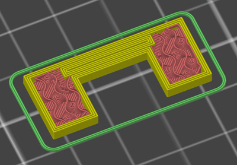
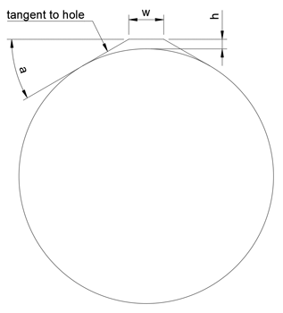
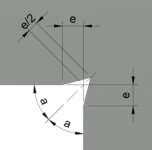
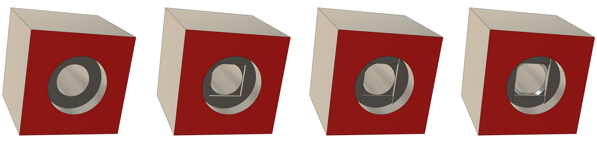
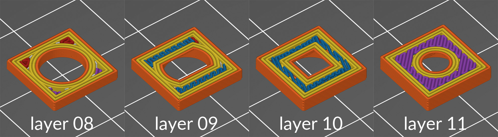

# SolidWorks 设计

以下内容来自[gregsaun的GitHub](https://github.com/gregsaun/maker_cheatsheet/blob/master/3d_printing/)
## 螺钉孔
### 螺钉孔直径
#### 内六角螺钉 ISO 4762 / DIN 912
| 螺纹尺寸 | 紧密配合 (mm) | 标准配合 (mm) |
| -------- | ------------- | ------------- |
| M3       | 3.2           | 3.3           |
| M4       | 4.2           | 4.3           |
| M5       | 5.2           | 5.3           |

## 螺钉头孔
### 适配螺钉头的孔
#### 内六角螺钉 ISO 4762 / DIN 912
| 螺纹尺寸 | 紧密配合 (mm) | 标准配合 (mm) | 宽松配合 (mm) | 高度 (mm) |
| -------- | ------------- | ------------- | ------------- | --------- |
| M3       | 5.6           | 5.8           | 6.0           | 3         |

#### 圆头螺钉 ISO 7380
| 螺纹尺寸 | 紧密配合 (mm) | 标准配合 (mm) | 宽松配合 (mm) | 高度 (mm) |
| -------- | ------------- | ------------- | ------------- | --------- |
| M5       | 9.8           | 10.0          | 10.5          | 2.8       |

## 自攻螺钉孔
### 使用公制螺钉作为自攻螺钉的孔径
#### 内六角螺钉 ISO 4762 / DIN 912
| 螺纹尺寸 | 孔径 (mm) |
| -------- | --------- |
| M2       | 1.7       |
| M3       | 2.7       |

## 螺母槽
### 多边形孔以适配螺母
#### 六角螺母 DIN 934
| 螺纹尺寸 | 紧密配合 (mm) | 标准配合 (mm) | 高度 (mm) |
| -------- | ------------- | ------------- | --------- |
| M3       | 6.2           | 6.4           | 2.5       |

#### 尼龙锁紧螺母 DIN 985
| 螺纹尺寸 | 紧密配合 (mm) | 标准配合 (mm) | 高度 (mm) |
| -------- | ------------- | ------------- | --------- |
| M3       | 6.2           | 6.4           | 4.1       |

#### 方形螺母 DIN 562
| 螺纹尺寸 | 紧密配合 (mm) | 标准配合 (mm) | 高度 (mm) |
| -------- | ------------- | ------------- | --------- |
| M3       | 5.5           | 5.6           | 2         |

## 选择性填充

选择性填充是一种用于创建更强的3D打印部件的技术。它包括在填充的中间创建一个孔，这样切片软件将在这个孔周围创建外周。同样，它还会为这个孔添加顶部和底部层。正确放置选择性填充，可以使外周或顶部/底部层加倍。要实现这一点，你需要知道底部/顶部层的厚度、外周的宽度以及可以应用的最小孔尺寸。

我第一次在Prusa OpenSCAD文件中看到类似的技术，最近在[Adrian Bowyer](https://reprapltd.com/fibre/)的一篇有趣文章中也看到了。

### 最小孔尺寸

Slic3r和PrusaSlicer会将小于或等于0.10mm x 0.10mm的孔视为STL中的缺陷并忽略它。因此，我通常使用0.101x0.101mm作为选择性填充的最小孔尺寸。你也可以使用更大的孔。

### 外周宽度

外周是相互重叠的，因此你需要考虑这种重叠。Slic3r文档解释了如何计算重叠：[manual.slic3r.org/advanced/flow-math#spacing-paths](manual.slic3r.org/advanced/flow-math#spacing-paths)

注意：对于桥接不应用重叠，但在进行选择性填充时，这种情况很少有用。

| 参数               | 公式                                              | 数值示例   |
| ------------------ | ------------------------------------------------- | ---------- |
| 挤出宽度           |                                                   | 0.45mm     |
| 层高               |                                                   | 0.20mm     |
| 外周数量           |                                                   | 4          |
| 挤出间距           | 挤出宽度 - 层高 * (1 - π/4)        | 0.4071mm   |
| 外周总宽度         | 挤出宽度 + (外周数量 - 1) * 挤出间距 | 1.67mm     |

### 顶部和底部厚度

| 参数               | 公式                     | 数值示例   |
| ------------------ | ------------------------ | ---------- |
| 层高               |                          | 0.20mm     |
| 顶部/底部层数      |                          | 5          |
| 顶部/底部厚度      | 顶部/底部层数 * 层高 | 1mm        |

## 干净的垂直孔

用于在垂直孔顶部留出更多空间，避免打印后的清理工作。我首先在Prusa OpenScad文件中发现了这种技术，但我定义了自己的方法以实现良好的效果。

- h = 层高
- a = 30°
- w = 如果孔太小，w 将等于或小于0。在这种情况下，我建议使角度“a”更垂直。

对于直径小于3mm的孔，我使用以下值制作一个简单的三角形（顶部没有平面）：
- h >= 层高
- a >= 30°
- w = 0

## 锐角

打印角度时，细丝会采取一个小的捷径，导致角度变圆。经过多次使用PETG的测试，我发现这种几何形状可以创建更好的方形角。对于其他类型的细丝可能需要进行一些调整。

- e = 挤出宽度
- a = 角度（对于90°打印角度为45°）

## 半空中孔

这种技术允许在半空中打印一个孔，无需支撑或后处理。此技术的原理是强制切片器进行桥接以支撑孔。

下面的图片展示了如何在CAD中逐步设计这种技术（红色表面将在切片器中接触打印床）。每一步对应于你的层高。最后一步添加倒角不是强制性的，但可以提高打印质量（我使用0.3mm 45°倒角用于0.2mm层高）：

为了更好地理解其工作原理，下面的图片展示了你在切片器中看到的内容：

你可以下载这个部件进行测试：[STEP File](files/mid_air_hole.step) 或 [STL File](files/mid_air_hole.stl)

Adam来自Vector 3D的优秀视频也解释了这种技术：[YouTube视频](https://www.youtube.com/watch?v=IVtqAn4oDDE)