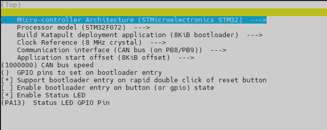

# Katapult bootloader

[Katapult](https://github.com/Arksine/katapult) 以前叫CanBoot，是一个允许通过CANBUS来更新MCU固件的bootloader。
通过Katapult可以实现免物理接触直接升级MCU固件。本页将教你如何给VAST Stealthburner内嵌CAN控制板添加Katapult。

## 下载Katapult
克隆Katapult项目：
``` bash
cd ~
git clone https://github.com/Arksine/katapult
```
（可选）添加Katapult到moonraker更新管理器，添加以下内容到moonraker的配置文件：
``` yaml title="moonraker.conf"
[update_manager Katapult]
type: git_repo
origin: https://github.com/Arksine/katapult.git
path: ~/katapult
is_system_service: False
```

## 配置Katapult
使用以下命令打开配置界面：
``` bash
cd ~/katapult
make menuconfig
```
配置设置如下：

- Micro-controller Architecture: **STMicroelectronics STM32**
- Processor model: **STM32F072**
- Build Katapult deployment application: **8KiB bootloader**
- Clock Reference: **8 MHz crystal**
- Communication interface: **CAN bus (on PB8/PB9)**
- Application start offset: **8KiB offset**
- CAN bus speed: **1000000**
- Support bootloader entry on rapid double click of reset button: **选中** *（非必须，但是建议开启）*
- Enable Status LED: **选中**
- Status LED GPIO Pin: **PA13**

配置好后应该是这样：
<figure markdown>
  
  <figcaption>Katapult配置</figcaption>
</figure>
按 `q` 退出，然后按 `y` 保存设置。

使用以下命令清除缓存，编译Katapult：
``` bash
make clean
make
```

## 首次将Katapult写入MCU
??? danger "在进行DFU操作的时候，请确保人在旁边"

    因DFU模式下IO状态可能发生变化，造成如加热棒自动开始加热等不确定事项，所以在进行DFU操作的时候，请确保人在旁边！

断开VAST Stealthburner内嵌CAN控制板的24V电源，按住重置按钮不松手，然后插上USB线，再松手。
使用 `dfu-util -l` 命令，如果出现了新设备就说明操作成功。

使用以下命令将BootLoader写入MCU：
``` bash
dfu-util -a 0 -D ~/katapult/out/katapult.bin -s 0x08000000:mass-erase:force:leave
```
提示File downloaded successfully即表示写入完成。

## 更新Katapult
要对Katapult进行更新升级，有2种方式可以操作。

### 通过USB更新Katapult
如果想通过USB更新Katapult(比如想要完全清除MCU固件并重新写入)可以通过[首次将Katapult写入MCU](#首次将Katapult写入MCU)

### 通过CAN更新Katapult
如果VAST Stealthburner内嵌CAN控制板已经有了Katapult bootloader，则可以通过以下命令更新：
``` bash
python3 ~/katapult/scripts/flash_can.py -f ~/katapult/out/katapult.bin -i can0 -u <uuid>
```
