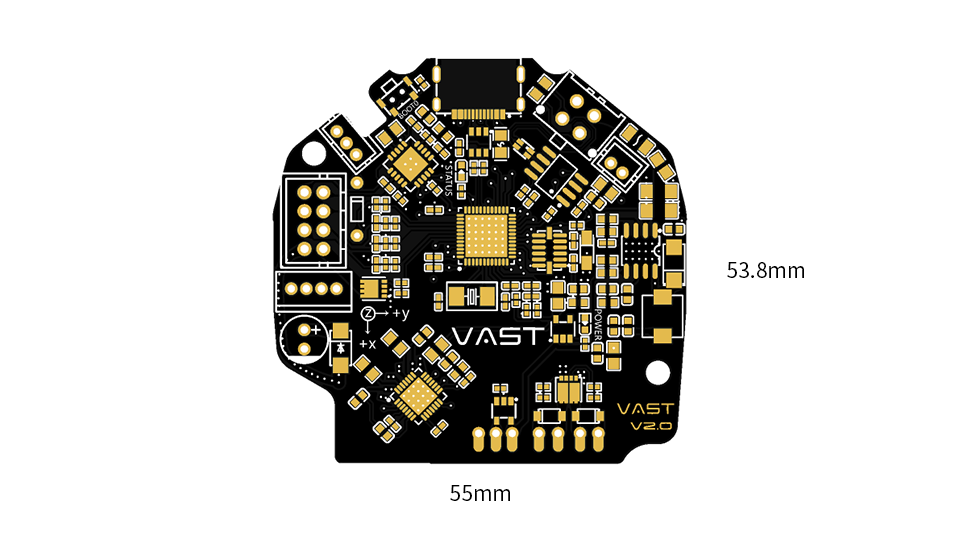
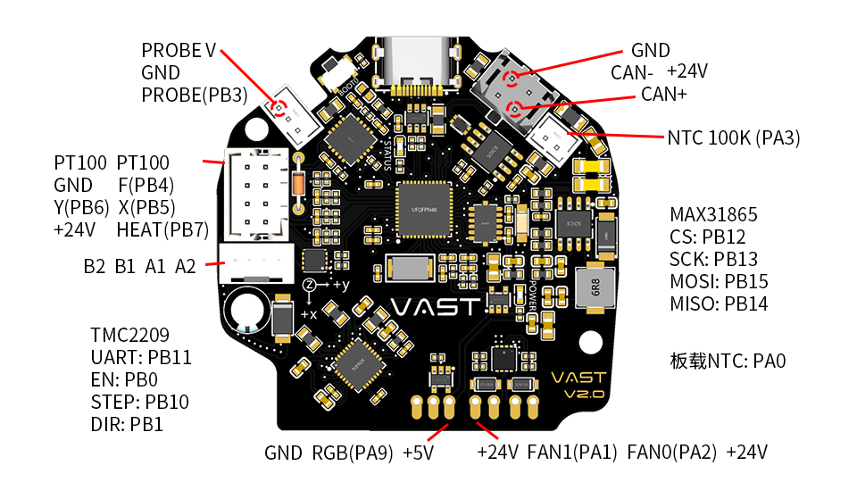

# VAST Stealthburner内嵌CAN控制板

本页是关于VAST Stealthburner内嵌CAN控制板使用Klipper的相关说明。

!!! success "此文档在以下条件中测试通过:"

    - VAST Stealthburner控制板 v2.0
    - Klipper 0.11.0-267
    - Moonraker 0.8.0-138
    - Mainsail 2.7.1

## V2.0

### 硬件

- **MCU:** STM32F072
- **步进电机驱动:** 板载TMC2209
- **板载加速度传感器:** ADXL345
- **板载温度转换芯片:** Max31865 2线PT100
- **输入电压:** DC24V 6A
- **IO逻辑电压:** DC 3.3V
- **加热端口:** 热端最大输出电流: 5A
- **风扇接口:** 2个可控风扇 (FAN0, FAN1)
- **风扇最大输出电流:** 1A
- **接口:** EndStop, Probe, RGB, PT100, NTC, USB, CAN
- **可选温度传感器:** 1路100K NTC, 1路PT100
- **额外板载温度传感器** 1路100K NTC
- **USB接口:** USB-Type-C
- **DC 5V最大输出电流:** 2A

### 引脚说明

| 功能 | 引脚 | 备注 |
| :----: | :----: | :----: |
| TH1 | PA0 |   |
| FAN1 | PA1 |   |
| FAN0 | PA2 |   |
| TH0 | PA3 |   |
| ADXL345_CS | PA4 |   |
| ADXL345_SCK | PA5 |   |
| ADXL345_MISO | PA5 |   |
| ADXL345_MOSI | PA7 |   |
| TMC_EN | PB0 |   |
| TMC_DIR | PB1 |   |
| TMC_STEP | PB10 |   |
| TMC_UART | PB11 |   |
| CAN_TX | PB9 |   |
| CAN_RX | PB8 |   |
| HEAT | PB7 |   |
| Y | PB6 | 已上拉，配置需要加 ^ |
| X | PB5 | 已上拉，配置需要加 ^ |
| F | PB4 | 已上拉，配置需要加 ^ |
| PROBE | PB3 | 已上拉，配置需要加 ^ |
| RGB | PA9 |   |
| PT100_MOSI | PB15 |   |
| PT100_MISO | PB14 |   |
| PT100_SCK | PB13 |   |
| PT100_CS | PB12 |   |

### DIY资料

提供全套DIY资料，使用前请用3D模型适配，是否能够正常安装。

- [原理图](SB-CAN V2.0 SCH.pdf)
- [制造文件](SB-CAN V2.0 GERBER.zip)
- [焊接辅助](SB-CAN V2.0 焊接辅助.html)
- [BOM](SB-CAN V2.0 BOM.xlsx)
- [3D模型](SB-CAN V2.0 3D.zip)

