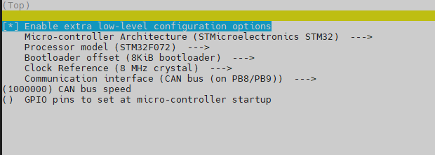

# Klipper固件
VAST Stealthburner内嵌CAN控制板可通过CAN控制，本页面将教你如何刷写klipper固件，并配置使用。

## 配置Klipper固件
使用以下命令打开配置界面：
``` bash
cd ~/klipper
make menuconfig
```
配置设置如下：

- Enable extra low-level configuration options: **选中**
- Micro-controller Architecture: **STMicroelectronics STM32**
- Processor model: **STM32F072**
- Bootloader offset: **No bootloader** *(不使用CanBoot)*
- Bootloader offset: **8KiB bootloader** *(使用CanBoot)*
- Clock Reference: **8 MHz crystal**
- Communication interface: **CAN bus (on PB8/PB9)**
- CAN bus speed: **1000000**

配置好后应该是这样：
<figure markdown>
  
  <figcaption>Klipper配置</figcaption>
</figure>
按 `q` 退出，然后按 `y` 保存设置。

使用以下命令清除缓存，编译klipper固件：
``` bash
make clean
make
```

## 将Klipper固件写入MCU
有2种方式可以操作。

- [通过USB更新Klipper固件](#通过USB更新Klipper固件) 
- [通过CAN更新Klipper固件](#通过CAN更新Klipper固件) （推荐使用）（需要有Katapult bootloader）

### 通过USB更新Klipper固件

??? danger "在进行DFU操作的时候，请确保人在旁边"

    因DFU模式下IO状态可能发生变化，造成如加热棒自动开始加热等不确定事项，所以在进行DFU操作的时候，请确保人在旁边！

断开VAST Stealthburner内嵌CAN控制板的24V电源，按住重置按钮不松手，然后插上USB线，再松手。
使用 `dfu-util -l` 命令，如果出现了新设备就说明操作成功。

用以下命令将Klipper写入MCU：
``` bash
make flash
```

### 通过CAN更新Klipper固件
推荐使用此方法来更新Klipper固件。

VAST Stealthburner内嵌CAN控制板在写入Katapult bootloader并使用CAN连接后，使用以下命令找到UUID：
``` bash
python3 ~/katapult/scripts/flash_can.py -i can0 -q
```

找到UUID后，执行：
``` bash
python3 ~/katapult/scripts/flash_can.py -f ~/klipper/out/klipper.bin -i can0 -u <uuid>
```

## 将MCU添加到Klipper
最后将MCU添加到Klipper `printer.cfg`：
``` yaml title="printer.cfg"
[mcu VAST]
canbus_uuid: <uuid>

# MCU内部温度传感器
[temperature_sensor Toolhead_MCU]
sensor_type: temperature_mcu
sensor_mcu: vast
min_temp: 0
max_temp: 100
```

UUID也可以通过以下命令获取：
``` bash
~/klippy-env/bin/python ~/klipper/scripts/canbus_query.py can0
```

更多配置项可以参考[配置案例](SB-CAN V2.0 CONFIG.cfg)

